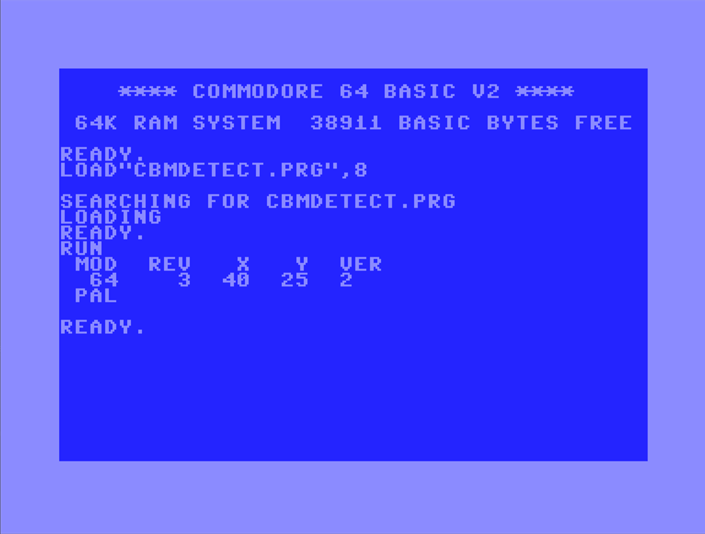

# CBM Detect

Commodore model detection displays model, firmware revision, text columns/rows, BASIC version, and PAL/NTSC

Supports Vic-20, C64, 264 series (C116, C16, plus/4), C128 including C64 running 64'er BASIC 3.5.  Displays detected RAM for 264 series.

Examples (will display one row of the following):

| Mod|Rev|  X|  Y| Ver|
| ---|---|---|---|----|
|  20| 22| 22| 23| 2  |
|  64|  0| 40| 25| 2  |
|  64|170| 40| 25| 2  |
|  64|  3| 40| 25| 2  |
|  64|  3| 40| 25| 3.5|
| 264|255| 40| 25| 3.5|
| 264|  0| 40| 25| 3.5|
| 128|  1| 40| 25| 7  |
| 128|  1| 80| 25| 7  |

Usage: 

````
LOAD "CBMDETECT.PRG",8
RUN
````

Output:

````
 MOD  REV   X   Y  VER
  64    3  40  25  2
 PAL
````

